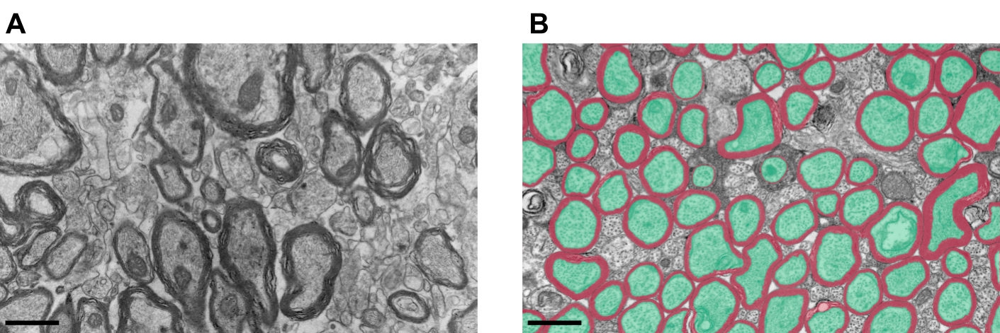
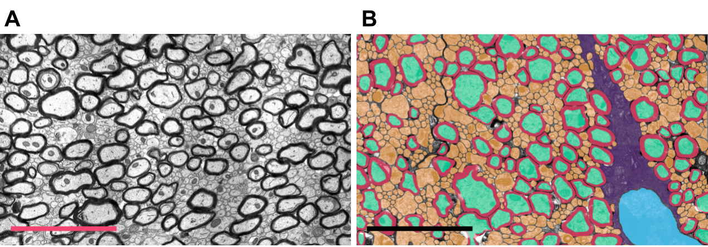
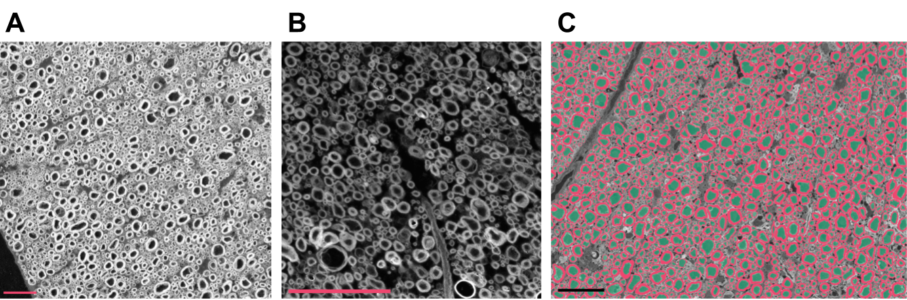
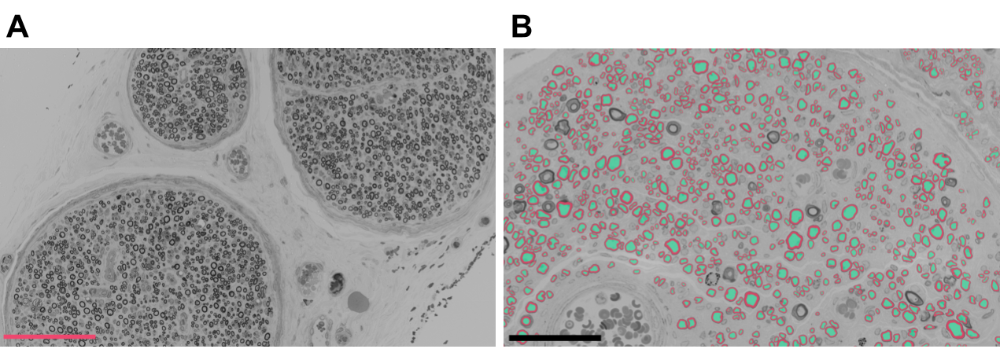

# 🧠 ASTIH: Axon Segmentation Training Initiative for Histology
The Axon Segmentation Training Initiative for Histology (ASTIH) is a growing collection of publicly available datasets for axon and myelin segmentation in histology images. This initiative aims to foster the development of robust and generalizable deep learning models applicable across diverse biological contexts and imaging techniques. By providing a wide range of data spanning multiple species, microscopy modalities, and resolutions, ASTIH seeks to bridge the gap between fundamental research and translational applications in neuroscience and pathology. We are committed to continuously maintain and expand this collection with new datasets in the future. 

<!--
**Fig. 1**
Images taken from the TEM1 dataset. Scalebars represent 1 micron. (A) Example image; (B) Other example with axon (green) and myelin (purple) ground-truth masks overlaid.


**Fig. 2**
Images taken from the TEM2 dataset. Scalebars represent 4 microns. (A) Example image; (B) Image with ground-truth masks overlaid (axon: green, myelin: pink, unmyelinated axons: orange, OL nucleus: blue, OL process: purple)



**Fig. 3**
Images taken from the SEM1 dataset. Scalebars represent 30 microns. (A) Example image; (B) An image with a different contrast; (C) Example with axon (green) and myelin (pink) ground-truth masks overlaid.



**Fig. 4**
Images taken from the BF1 dataset. (A) Example image. Scalebar represent 100 microns; (B) Image with axon (green) and myelin (pink) ground-truth masks overlaid. Scalebar represent 50 microns.


-->
**Figure 1.** Examples of raw and annotated images for every dataset currently online. Scalebars: TEM1: 1 μm; TEM2: 4 μm; SEM1: 30 μm; BF1: (left) 100 μm, (right) 50 μm; BF2: 50 μm.


## 💾 Getting started
#### Clone the repo
```
git clone https://github.com/axondeeepseg/ASTIH.git
cd ASTIH
```

#### Setup a virtual environment
```
conda create python==3.12.9 -n astih
conda activate astih
conda env update --file environment.yaml
```

#### Download the data
```
python scripts/get_data.py --make-splits
```

#### Download models and run the evaluation
```
python scripts/get_models.py
python scripts/apply_models.py
```

## 🔬 Key features
1. A comprehensive, publicly accessible collection of four histology datasets specifically designed for developing and evaluation axon and myelin segmentation models. This collection encompasses unprecedented diversity, featuring over 60,000 manually segmented fibers across three microscopy modalities (TEM, SEM, optical), two species, three regions of the nervous system and various biological conditions.
2. Detailed annotations for every datasets with standardized boundary delineation between adjacent fibers, enabling both semantic and instance segmentation tasks.
3. Baseline state-of-the-art segmentation models for every dataset, providing a standardized framework for comparative evaluation of future methods. These models are publicly available and can all be used within the [AxonDeepSeg](www.github.com/axondeepseg/axondeepseg) open-source software.

## ✍️ Contributing
We welcome contributions of new data that align with the goals of ASTIH. If you have a relevant dataset you would like to share, please contact us at axondeepseg@googlegroups.com

## 📜 License
The code and documentation in this repository are released under the [MIT License](LICENSE). The individual datasets within ASTIH may have their own specific licenses, which will be clearly stated in their respective descriptions.

## 🔗 Citation
[WIP]
